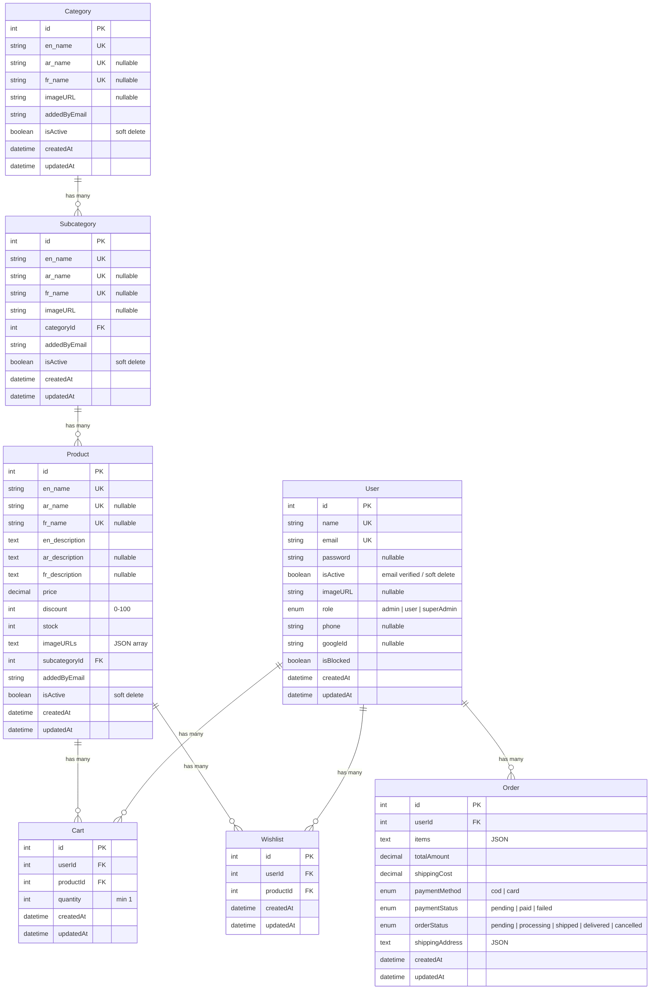

# E-Commerce Backend

Full-featured e-commerce backend API built with **TypeScript**, **Express**, **Sequelize** (MSSQL), **Redis**, **Passport.js**, and **JWT** authentication.

## Tech Stack

| Layer | Technology |
|-------|-----------|
| Runtime | Node.js + TypeScript |
| Framework | Express 5 |
| ORM | Sequelize 6 |
| Database | MSSQL (via tedious) |
| Cache / OTP | Redis (Upstash) |
| Auth | JWT (role-based signatures) + Passport (Google OAuth) |
| Validation | Joi |
| Logging | Winston |
| File Upload | Cloudinary (via multer) |
| Payments | Stripe / PayPal (SDKs installed) |

## Prerequisites

- Node.js >= 18
- MSSQL instance
- Redis instance (or Upstash URL)
- Google OAuth credentials (for social login)
- Cloudinary account (for image uploads)

## Setup

```bash
# Clone and install
npm install

# Create environment file
cp config/.env.example config/.env
```

### Environment Variables (`config/.env`)

| Variable | Description |
|----------|-------------|
| `PORT` | Server port (default: 3007) |
| `BASE_URL` | Server base URL (e.g. `http://localhost:3007`) |
| `DB_HOST` | MSSQL host |
| `DB_PORT` | MSSQL port |
| `DB_NAME` | Database name |
| `DB_USER` | Database user |
| `DB_PASSWORD` | Database password |
| `DATA_BASE_URL_MY` | Full MSSQL connection string |
| `REDIS_URL` | Redis connection URL |
| `EMAIL` | Nodemailer email |
| `PASSWORD` | Nodemailer password |
| `HASH` | Bcrypt salt rounds |
| `VERIFY_SIGNATURE_MY` | JWT secret for email verification tokens |
| `SIGNATURE_ADMIN` | JWT secret for admin tokens |
| `SIGNATURE_USER` | JWT secret for user tokens |
| `SIGNATURE_SUPER_ADMIN` | JWT secret for super admin tokens |
| `ACCESS_TOKEN` | Access token expiry (e.g. `30m`) |
| `REFRESH_TOKEN` | Refresh token expiry (e.g. `1y`) |
| `GOOGLE_CLIENT_ID` | Google OAuth client ID |
| `GOOGLE_CLIENT_SECRET` | Google OAuth client secret |
| `CLOUDINARY_NAME` | Cloudinary cloud name |
| `CLOUDINARY_KEY` | Cloudinary API key |
| `CLOUDINARY_SECRET` | Cloudinary API secret |
| `INFOBIP_BASE_URL` | Infobip API base URL (WhatsApp OTP) |
| `INFOBIP_API_KEY` | Infobip API key |
| `INFOBIP_WHATSAPP_SENDER` | Registered WhatsApp sender number |
| `SHIPPING_COST_TYPE` | Shipping cost calculation: `fixed` or `percentage` |
| `SHIPPING_COST_VALUE` | Shipping cost amount (flat) or percent (e.g. `50` or `10`) |
| `Publishable_key_Stripe` | Stripe publishable key |
| `Secret_key_Stripe` | Stripe secret key |
| `STRIPE_WEBHOOK_SECRET` | Stripe webhook signing secret |

## Run

```bash
# Development (hot reload)
npm run dev

# Build
npm run build

# Production
npm start
```

## API Endpoints

Prefix: `/v1`

### Auth (`/v1/auth`)

| Method | Endpoint | Auth | Description |
|--------|----------|------|-------------|
| POST | `/signup` | - | Register with email/password |
| POST | `/login` | - | Login with email/password |
| GET | `/google/signup` | - | Google OAuth signup (`?role=user\|admin`) |
| GET | `/google/signup/callback` | - | Google signup callback |
| GET | `/google/login` | - | Google OAuth login |
| GET | `/google/login/callback` | - | Google login callback |
| GET | `/verify-email/:token` | - | Verify email from link |
| POST | `/resend-verify-email` | R60 | Resend verification email |
| POST | `/forgot-password` | R60 | Send password reset email |
| POST | `/reset-password/:token` | R60 | Reset password |

> `R60` = rate-limited to 1 request per 60 seconds

### User (`/v1/user`)

| Method | Endpoint | Auth | Description |
|--------|----------|------|-------------|
| GET | `/profile` | User | Get authenticated user profile |
| PUT | `/profile` | User | Update profile (`phone`, `image` file) — image uploaded to Cloudinary |
| POST | `/upload-avatar` | Any | Upload profile image to Cloudinary, deletes old one |

### Phone / OTP (`/v1/phone`)

| Method | Endpoint | Auth | Description |
|--------|----------|------|-------------|
| POST | `/send-otp` | User | Send 6-digit OTP to phone via Infobip WhatsApp (stored in Redis 5min) |
| POST | `/verify-otp` | User | Verify OTP and save phone number to user profile |

### Categories (`/v1/category`)

| Method | Endpoint | Auth | Description |
|--------|----------|------|-------------|
| GET | `/categories` | - | List active categories |
| GET | `/categories/:id` | - | Get active category |
| GET | `/categories/:id/subcategories` | - | Get subcategories of a category |
| POST | `/categories/admin` | Admin | Create category (`name` + optional `image` file) — Cloudinary upload + file-type validation |
| PUT | `/categories/admin/:id` | Admin | Update category — Cloudinary, deletes old image |
| DELETE | `/categories/admin/:id` | Admin | Soft delete category (cascades to subcategories & products) |

### Subcategories (`/v1/subcategory`)

| Method | Endpoint | Auth | Description |
|--------|----------|------|-------------|
| GET | `/subcategories` | - | List active subcategories |
| GET | `/subcategories/:id` | - | Get active subcategory |
| GET | `/subcategories/admin` | Admin | List all subcategories |
| GET | `/subcategories/admin/:id` | Admin | Get subcategory by ID |
| POST | `/subcategories/admin` | Admin | Create subcategory (`name`, `categoryId` + optional `image` file) — Cloudinary |
| PUT | `/subcategories/admin/:id` | Admin | Update subcategory — Cloudinary, deletes old image |
| DELETE | `/subcategories/admin/:id` | Admin | Soft delete (cascades to products) |

### Products (`/v1/products`)

| Method | Endpoint | Auth | Description |
|--------|----------|------|-------------|
| GET | `/products` | - | List active products (filter/paginate) |
| GET | `/products/:id` | - | Get active product |
| GET | `/products/category/:categoryId` | - | Filter by category |
| GET | `/products/subcategory/:subcategoryId` | - | Filter by subcategory |
| GET | `/products/admin` | Admin | List all products |
| GET | `/products/admin/:id` | Admin | Get any product |
| POST | `/products/admin` | Admin | Create product (`name`, `price`, `subcategoryId` + optional `images[]` up to 5) — Cloudinary |
| PUT | `/products/admin/:id` | Admin | Update product — Cloudinary, deletes old images |
| DELETE | `/products/admin/:id` | Admin | Soft delete product |

#### Product Query Parameters

```
?page=1&limit=10&minPrice=10&maxPrice=100&sort=price_asc
```

| Param | Type | Description |
|-------|------|-------------|
| `page` | integer | Page number (default: 1) |
| `limit` | integer | Items per page 1-100 (default: 10) |
| `minPrice` | number | Minimum price filter |
| `maxPrice` | number | Maximum price filter |
| `sort` | string | Sort: `price_asc`, `price_desc`, `name_asc`, `name_desc` |

### Cart (`/v1/cart`)

All cart endpoints require **User** auth.

| Method | Endpoint | Description |
|--------|----------|-------------|
| POST | `/cart` | Add item (`productId`, `quantity`) |
| GET | `/cart` | View cart with subtotals & total |
| PUT | `/cart/:productId` | Update quantity |
| DELETE | `/cart/:productId` | Remove item (hard delete) |
| DELETE | `/cart` | Clear entire cart (hard delete) |

- Validates product exists and is active
- Validates quantity ≤ stock
- If item already in cart, adds to existing quantity (capped at stock)
- Response includes per-item `subtotal` and cart `total` (respects discount %)

### Orders (`/v1/order`)

| Method | Endpoint | Auth | Description |
|--------|----------|------|-------------|
| POST | `/orders` | User | Create order — validates stock, deducts quantity, snapshots price. **Card**: returns `{ url, orderId }` for Stripe redirect. **COD**: returns created order. |
| GET | `/orders/mine` | User | List authenticated user's orders |
| GET | `/orders/:id` | User | Get order by ID (own or admin) |
| GET | `/orders/admin` | Admin | List all orders |
| PATCH | `/orders/admin/:id` | Admin | Update order status / payment status |
| POST | `/webhook` | - | **Stripe webhook** — receives `checkout.session.completed`, updates payment to `paid` + status to `processing` |

- On creation: validates each product exists and has sufficient stock
- If stock insufficient, returns `{ available, requested }` per product
- Prices are snapshotted at purchase (including discount)
- Items and shipping address stored as JSON
- **COD orders** include a shipping cost (fixed amount or percentage of subtotal, configurable via `SHIPPING_COST_TYPE` / `SHIPPING_COST_VALUE`)
- **Card orders**: creates Stripe Checkout Session with line items + metadata (orderId). Frontend redirects user to `session.url`. On successful payment, Stripe calls `/v1/order/webhook` → order becomes `paid`/`processing`
- `totalAmount` = subtotal + shippingCost (shipping only applied for COD)

### Wishlist (`/v1/wishlist`)

All wishlist endpoints require **User** auth.

| Method | Endpoint | Description |
|--------|----------|-------------|
| POST | `/wishlist` | Add product (`productId`) — prevents duplicates |
| GET | `/wishlist` | View wishlist with product details |
| DELETE | `/wishlist/:productId` | Remove item |

### Admin / Security (`/v1/admin`)

| Method | Endpoint | Auth | Description |
|--------|----------|------|-------------|
| GET | `/security/logs` | SuperAdmin | Return all `security.log` entries as JSON |

## Auth System

### Token-Based (JWT)

- **Access token**: short-lived (default `30m`), signed with role-specific secret
- **Refresh token**: long-lived (default `1y`), signed with `secret + "_refresh"`
- Bearer token format: `<role> <token>` (e.g. `user eyJhbGci...`)

### Roles

| Role | Level |
|------|-------|
| `user` | Regular user — can browse, cart, wishlist, order |
| `admin` | Admin — can manage categories, products, view all |
| `superAdmin` | Super admin — access to security logs, elevated control |

### Google OAuth

Two Passport strategies: `google-signup` (accepts `?role` in state) and `google-login`.

## Security

### Injection Detection

All Joi validation schemas use a custom `detectInjection` rule that checks for:
- SQL keywords (`SELECT`, `DROP`, `UNION`, `INSERT`, `UPDATE`, `DELETE`)
- NoSQL operators (`$ne`, `$gt`, `$regex`, `$eq`)
- SQL comment syntax (`--`, `;`)

Suspicious input is rejected with a 400 error and logged to `security.log` via Winston.

### Security Logs

**File:** `security.log` (project root)

```json
{"timestamp":"2026-06-14T15:23:45","ipAddress":"192.168.1.100","type":"SECURITY_ALERT","potentialInjection":"DROP TABLE users","message":"Possible injection attempt detected","level":"warn"}
```

SuperAdmin can view all logs at `GET /v1/admin/security/logs`.

### IP Blocking

When an injection attempt is detected, the attacker's IP is **permanently blocked** in Redis (`blocked:<ip>`). A global middleware checks every incoming request and returns `403 Access denied. IP is permanently blocked.` for blocked IPs. To unblock an IP, delete the key from Redis: `DEL blocked:<ip>`.

- Blocked IPs survive server restarts (stored in Redis)
- Blocking applies to **all routes** (checked before any controller logic)

## Database

### ER Diagram



### Table Relationships

| Parent | Child | Type | Foreign Key |
|--------|-------|------|-------------|
| `Category` | `Subcategory` | One-to-Many | `subcategory.categoryId` → `category.id` |
| `Subcategory` | `Product` | One-to-Many | `product.subcategoryId` → `subcategory.id` |
| `Product` | `Cart` | One-to-Many | `cart.productId` → `product.id` |
| `Product` | `Wishlist` | One-to-Many | `wishlist.productId` → `product.id` |
| `User` | `Cart` | One-to-Many | `cart.userId` → `user.id` |
| `User` | `Wishlist` | One-to-Many | `wishlist.userId` → `user.id` |
| `User` | `Order` | One-to-Many | `order.userId` → `user.id` |

### Soft Delete

All major entities (`Category`, `Subcategory`, `Product`, `User`) use `isActive` boolean instead of hard delete. Admin endpoints see all records; public endpoints filter to `isActive: true`. Deleting a parent cascades deactivation to children:

- **Delete Category** → deactivates its Subcategories → deactivates their Products
- **Delete Subcategory** → deactivates its Products
- **Delete Product** → deactivates only that product

### Notes

- `Cart` and `Wishlist` use **hard delete** (records are destroyed, not soft-deleted)
- `Order` stores `items` and `shippingAddress` as JSON strings (parsed on read)
- `Product.imageURLs` is a JSON string array of Cloudinary URLs
- All monetary values use `DECIMAL(10,2)` precision
- `discount` is a percentage (0–100), applied as: `effectivePrice = price - (price * discount / 100)`

## Scripts

| Command | Description |
|---------|-------------|
| `npm run dev` | Start dev server with hot reload |
| `npm run build` | Compile TypeScript |
| `npm start` | Run compiled JS |
| `npm test` | Run tests (Jest) |
| `npm run lint` | Lint with ESLint |
| `npm run format` | Format with Prettier |
| `npm run cy:open` | Open Cypress E2E test runner |
| `npm run cy:run` | Run Cypress E2E tests headlessly |
| `npm run cy:run:chrome` | Run Cypress E2E tests in Chrome |
| `python generate_module.py <name>` | Scaffold a new module folder |

## Testing

### Unit / Integration (Jest)
```bash
npm test
```

### E2E (Cypress)

The project includes comprehensive Cypress E2E tests covering all 52 endpoints:

| Test file | Module | Tests |
|-----------|--------|-------|
| `auth.cy.ts` | Auth (signup, login, verify, reset, OAuth) | 14 |
| `user.cy.ts` | User profile + Phone OTP | 14 |
| `category.cy.ts` | Category CRUD + public routes | 11 |
| `subcategory.cy.ts` | Subcategory CRUD + public routes | 10 |
| `wishlist.cy.ts` | Wishlist CRUD | 7 |
| `cart.cy.ts` | Cart CRUD + auth guards | 14 |
| `product.cy.ts` | Product CRUD + public listing + filters | 17 |
| `order.cy.ts` | Order creation, validation, admin status | 16 |
| `security.cy.ts` | Security logs (superAdmin only) | 3 |

**Total: ~106 test cases**

```bash
# Prerequisite: server must be running
npm run dev

# In another terminal:
npx cypress run
```

## Project Structure

```
├── .prettierrc
├── cypress/
│   ├── e2e/          # Test files (.cy.ts)
│   ├── support/      # Custom commands
│   └── fixtures/     # Test data
├── cypress.config.ts
├── config/
│   ├── .env              # Environment variables
│   └── env.service.ts    # Env loader
├── src/
│   ├── index.ts          # Entry point
│   ├── app.controller.ts # Express app setup, routes registration
│   ├── common/
│   │   ├── email/        # Nodemailer transporter
│   │   ├── middleware/    # auth, blocklist, detectInjection, logger, multer
│   │   ├── utils/         # allowRoles, buildQuery, rateLimit, validate, validateImage
│   │   └── whatsapp/      # Infobip WhatsApp OTP sender
│   ├── database/
│   │   ├── connection.ts # Sequelize + MSSQL
│   │   ├── redis.connection.ts
│   │   ├── association.ts
│   │   └── model/        # All Sequelize models
│   └── module/
│       ├── auth/         # Signup, login, OAuth, verify, reset
│       ├── user/         # Profile, upload avatar
│       ├── phone/        # WhatsApp OTP verification
│       ├── category/     # Category CRUD
│       ├── subcategory/  # Subcategory CRUD
│       ├── product/      # Product CRUD + public listing
│       ├── cart/         # Cart CRUD
│       ├── wishlist/     # Wishlist CRUD
│       ├── order/        # Order creation, stock deduction, Stripe checkout + webhook
│       └── security/     # Security log viewer
├── generate_module.py    # Module scaffold generator
└── security.log          # Injection attempt logs
```
